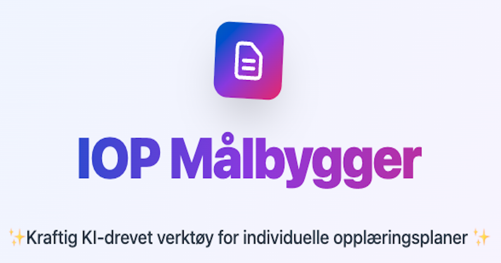

<div align="center">
  
  
  # IOP Målbygger
  
  **Kraftig KI-drevet verktøy for individuelle opplæringsplaner**
  
  [](https://opensource.org/licenses/MIT)
  [](https://reactjs.org/)
  [](https://ai.google.dev/)
  
  [📚 Dokumentasjon](#-kom-i-gang) • [🐛 Rapporter Bug](https://github.com/barx10/IOP-m-lgenerator/issues) • [💡 Feature Request](https://github.com/barx10/IOP-m-lgenerator/issues)
</div>

---

## ✨ Om prosjektet

IOP Målbygger er et AI-drevet verktøy designet for norske lærere og spesialpedagoger. Med kunstig intelligens fra Google Gemini genererer verktøyet skreddersydde kompetansemål for elever med spesialundervisning, basert på læreplanen (LK20).

### 🎯 Hovedfunksjoner

- 🤖 **AI-genererte mål** - Automatisk generering basert på kompetansemål fra læreplanen
- 📚 **Alle fag og trinn** - Støtte for 1.-10. trinn på barneskole og ungdomsskole
- 🎓 **To vanskelighetsgrader** - Tilpasset og utfordrende nivå for hver elev
- 💾 **Sammenlign fag** - Lagre og arbeide med flere fag samtidig
- 🖨️ **Utskriftsvennlig** - Generer kompakte rapporter for alle fag
- 🔒 **Personvernsikker** - Ingen permanent lagring, data slettes ved refresh
- ⚡ **Rask og responsiv** - Optimalisert brukeropplevelse med moderne teknologi

---

## 🚀 Kom i gang

### Forutsetninger

- **Node.js** (v18 eller nyere)
- **npm** eller **yarn**
- **Gemini API-nøkkel** ([Få gratis her](https://aistudio.google.com/app/apikey))

### Installasjon (Lokal utvikling)

1. **Clone repositoryet:**
   ```bash
   git clone https://github.com/barx10/IOP-m-lgenerator.git
   cd IOP-m-lgenerator
   ```

2. **Installer avhengigheter:**
   ```bash
   npm install
   ```

3. **Sett opp miljøvariabler:**
   ```bash
   cp .env.example .env
   ```
   
   Åpne `.env` og legg til din Gemini API-nøkkel:
   ```bash
   GEMINI_API_KEY=din-api-nøkkel-her
   ```

4. **Start utviklingsserver:**
   ```bash
   npm run dev
   ```

5. **Åpne i nettleseren:**
   
   Gå til http://localhost:5173 (eller porten som vises i terminalen)

---

## 🌐 Deploy til produksjon

For sikker deployment med backend API og rate limiting, se vår detaljerte guide:

📖 **[DEPLOYMENT.md](DEPLOYMENT.md)** - Komplett Vercel deployment-guide

**Kort oppsummert:**
- Backend API beskytter API-nøkkelen
- Rate limiting (50 requests/time per IP)
- Automatisk deployment via GitHub
- Gratis hosting på Vercel

---

## 🛠️ Teknologi

<div align="center">

| Frontend | Backend | Deployment | AI |
|----------|---------|------------|-----|
| React 19 | Vercel Functions | Vercel | Google Gemini 2.0 Flash |
| TypeScript | Node.js | GitHub Actions | JSON Schema Output |
| Tailwind CSS | Rate Limiting | - | - |
| Vite | CORS | - | - |

</div>

---

## 📖 Slik bruker du verktøyet

1. **Velg fag og trinn** - F.eks. Matematikk, 5. trinn
2. **Velg tema** - F.eks. "Tallforståelse og brøk"
3. **Lim inn kompetansemål** - Fra læreplanen (LK20)
4. **Legg til sakkyndig vurdering** (valgfritt)
5. **Klikk "Generer IOP-forslag"** - AI genererer tilpassede mål
6. **Velg beste mål** - Velg ett ferdighetsmål og ett kunnskapsmål
7. **Lagre og utskriv** - Få en kompakt rapport for alle fag

---

## 🔒 Personvern og sikkerhet

- ✅ **PIN-gate** - Tilgangskontroll for autoriserte brukere
- ✅ **Ingen permanent lagring** - Data slettes ved refresh
- ✅ **Backend API** - API-nøkkel er sikret server-side
- ✅ **Rate limiting** - Beskyttelse mot misbruk (50 req/time)
- ✅ **GDPR-vennlig** - Ingen personopplysninger lagres
- ⚠️ **Viktig:** Anonymiser alltid elevdata før bruk

### 🔑 Få tilgang

For å bruke verktøyet trenger du en PIN-kode. Kontakt prosjekteier:
- 📧 E-post: **kenneth@laererliv.no**
- 🌐 Nettside: **[laererliv.no](https://www.laererliv.no/)**

_(Dette sikrer at verktøyet brukes ansvarlig og i riktig kontekst)_

---

## 🤝 Bidra

Vi setter pris på alle bidrag! Se vår [CONTRIBUTING.md](CONTRIBUTING.md) for retningslinjer.

### Rapporter bugs eller foreslå funksjoner:
- 🐛 [Rapporter en bug](https://github.com/barx10/IOP-m-lgenerator/issues/new?template=bug_report.yml)
- 💡 [Foreslå en funksjon](https://github.com/barx10/IOP-m-lgenerator/issues/new?template=feature_request.yml)

---

## 📄 Lisens

Dette prosjektet er lisensiert under MIT License - se [LICENSE](LICENSE) for detaljer.

---

## 👨‍💻 Om utvikler

**Kenneth Bareksten** - [Lærerliv](https://www.laererliv.no/)

Lærer og utvikler med lidenskap for å lage verktøy som gjør hverdagen enklere for lærere.

- 🌐 Website: [laererliv.no](https://www.laererliv.no/)
- 📧 Email: kenneth@laererliv.no
- 💼 GitHub: [@barx10](https://github.com/barx10)

---

## 🙏 Takk til

- **Google Gemini** - For kraftig og rimelig AI
- **Vercel** - For enkel og gratis hosting
- **Alle lærere** - Som tester og gir feedback

---

## 📊 Statistikk

- ⚡ **~30 sekunder** generering per IOP
- 💰 **~0.05 øre** per generering
- 🚀 **50 requests/time** rate limit
- 📈 **100% gratis** å bruke

---

<div align="center">
  
  **Laget med ❤️ for norske lærere**
  
  [⭐ Gi oss en stjerne](https://github.com/barx10/IOP-m-lgenerator) hvis du liker prosjektet!
  
</div>
